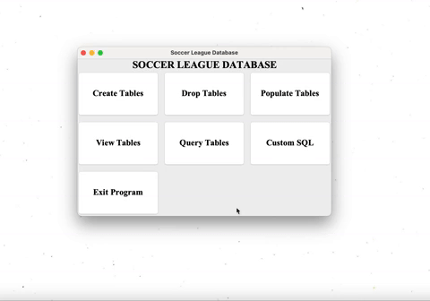
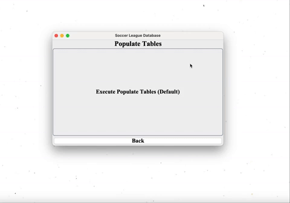
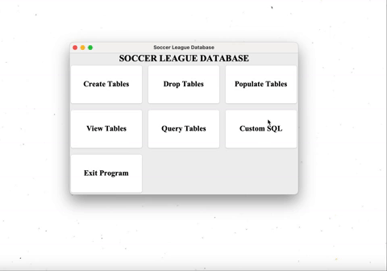
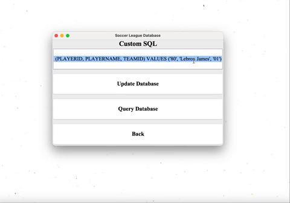

# Soccer League Application

## Overview
This repository contains a comprehensive soccer league application developed with **Java Swing** and **Oracle SQL**. The application allows users to manage league data efficiently, providing functionalities such as creating custom leagues, viewing league tables, and analyzing team, player, stadium, and match statistics through predefined and custom SQL queries. 

The backend is powered by an **Oracle 11g Database**, ensuring robust data handling, while the front end features an intuitive graphical user interface (GUI) developed using **Java Swing**. This application was created as part of a **Relational Database Systems course**, reinforcing key database concepts such as schema design, data modeling, functional dependencies, and normalization (including 3NF and BCNF). A detailed [project report](./Project_Report.pdf) further elaborates on the design and implementation of these concepts.

---

## Features

### Main Page
The main page serves as the application's navigation hub, providing access to various database operations via buttons. Each button corresponds to a specific task, such as table creation, population, or custom queries.

#### 1. Creating and Dropping Tables  
The application allows users to seamlessly create and drop tables with predefined SQL commands. These commands ensure proper table structure, including primary keys, foreign keys, and constraints.  

- **Creating Tables**: Ensures all required entities (teams, players, matches, etc.) and their relationships are established.  
- **Dropping Tables**: Removes all tables and associated constraints, ensuring a clean slate for rebuilding the schema.

#### 2. Populating Tables  
Users can populate tables with predefined data by pressing a button. The process inserts comprehensive sample records, including details for teams, players, matches, goals, and stadiums. This process provides a rich dataset for analysis.  
  
  

- The operation populates thousands of records in under 10 seconds. The database is then ready for querying and analysis.

---

### Query Page
The **Query Page** offers predefined SQL queries embedded directly into the application. These queries provide insights into the league's performance, player statistics, and match data.  
  

- **Example Queries**:
  - View league standings with calculated points based on wins, losses, and draws.
  - Analyze player performance, such as top goal-scorers or most assists.
  - Retrieve detailed match history, including dates, locations, and results.

Each query is executed efficiently, showcasing the relational database's capabilities and the application's ability to integrate seamlessly with SQL.

---

### Custom SQL
The **Custom SQL** feature allows users to write and execute their own SQL statements, providing full control over the database. This is particularly useful for advanced users or for performing operations not covered by predefined queries.

#### 1. Updating the Database  
Users can insert, update, or delete records by entering SQL commands directly into the GUI. This feature ensures flexibility in database management.  

#### 2. Querying the Database  
Users can write custom SELECT statements to retrieve specific data based on their requirements. The application returns results in an easily readable format within the GUI.  

---

## Usage

### Considerations
1. **Oracle Database Connection**: Ensure a connection to the Oracle 11g database, either via a VPN or a networked computer. This is mandatory for the application to function.  
2. **IDE Compatibility**: The application was developed using VS Code but can be run on any IDE that supports Java.

### Steps to Run
1. Clone this repository to your local machine.
2. Navigate to the `SoccerDB_GUI/src` directory.
3. Open and run the `Main.java` file in your IDE.

---

## Technical Details
### Database Design
- **Schema Design**: The database schema includes entities for players, teams, matches, goals, and stadiums, with well-defined relationships and constraints to maintain data integrity.
- **Normalization**: All tables comply with **3NF** and **BCNF**, eliminating redundancy and ensuring consistency.
- **Functional Dependencies**: Functional dependencies were identified and enforced during table creation to maintain strict adherence to database normalization principles.

### Key Concepts
- **3NF and BCNF**: Ensures each table is free of partial and transitive dependencies.
- **Predefined SQL Queries**: Optimized for quick and efficient data retrieval.
- **GUI Integration**: Combines Java Swing's user-friendly interface with SQL's powerful data manipulation capabilities.

---

## Improvements
Future enhancements aim to make the application more intuitive and scalable:
1. **Enhanced Usability**: Introduce GUI-based options to modify the database without SQL knowledge.
2. **Visual Enhancements**: Add color schemes and other aesthetic elements for a modern look.
3. **Alternative Database Options**: Support databases beyond Oracle 11g to reduce dependency on Oracle accounts.
4. **User Accounts**: Implement authentication with usernames and passwords for multi-user functionality.

---

This project exemplifies the seamless integration of database management and user interface design, providing an educational tool for understanding relational database systems and their applications.
