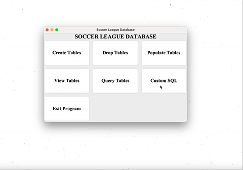

# Soccer League Application

## Overview
This repository contains a soccer league application developed with Java Swing and SQL. The Soccer League application currently allows users to create their own league and view the league table, as well as team, player, stadium, and match statistics through SQL statements. All data is stored, queried, and modified on Oracle 11g Database. An interactive GUI was programmed using Java Swing.

This project was developed for a Relational Database Systems course. Throughout the development process, important concepts such as schema building, data modelling,and database normalization (mainly 3NF and BCNF) were all reinforced. A detailed [project report](./Project_Report.pdf) expands on the implemtation of these concepts in this application.

## Features
### Main Page
The main page navigates the user to pages where different SQL statements can be executed with the press of a button. There are predefined SQL statements, embedded into the code for all pages, except Custom SQL.

1. Creating and Dropping tables 
 

2. Populating Tables (Pressing button) 
 
(After successful population) - Takes 10 seconds with many records 

### Query Page
The query page contains pre-defined SQL queries that are embedded into the code. Here, users can view the league table, player information, and other important statistics. 

 

### Custom SQL
The Custom SQL page allows users to enter their own SQL statements to modify and query the database.

1. Updating Database 
 

2. Querying Database (Custom Query) 
 
## Usage
Here are the steps to download the program onto your local machine. There are some considerations that must be taken.

### Considerations
1. Make sure you have an Oracle DB connection from your local machine. Whether it is through a VPN or a network computer, this is mandatory to be able to run the application.

2. This application was developed on VScode, but any IDE should be able to run this program.

### Steps
1. Clone this repo onto your local machine.

2. Go to SoccerDB_GUI/src

3. Run the file "Main.java"

## Improvements
Future improvements to this project include but are not limited to:
1. Making application more user intuitive - create pages that let users alter the DB without needing to know SQL

2. Adding colour and other visually pleasing elements to the application.

3. Opting for the different DB as Oracle DB requires an Oracle account.

4. Adding accounts with username and password to scale this project for multiple users.
